# Margin

An adaptive personal day planner for Android.

Margin is not a to-do list. Tasks and commitments are **inputs**; the day's schedule is the
**output** of a deterministic scheduling engine. You tell it what exists, and all day it
answers one question:

> Given everything I know about your day, what should you do now?

It ships already knowing a real timetable (MITS Kochi, S3 CS-A, Jul–Dec 2026), so the first
launch is a working plan rather than an empty dashboard.

---

## What it does

- **Knows the week.** The recurring timetable is seeded and editable, with per-date
  exceptions, and a new semester can be imported from a photo or PDF with a review step.
- **Keeps theory and lab apart.** Every subject is two tracks where it has a lab, and
  coverage is tracked per track, so no subject and no lab is ever quietly forgotten.
- **Guides the session.** "Time to study" when it starts; at the planned end, move to the
  next session or keep going, with the extra time recorded rather than lost.
- **Plans breaks from real work.** A break is suggested when the actual run of work has
  earned one, sooner on a low-energy day, without wrecking the rest of the plan.
- **Offers build and learning time.** Project work and new skills are first-class, offered
  once academics are handled. "Not today" is always an answer, and it is never held against you.
- **Protects leisure.** Leisure is a floor, reserved before any work is placed.
- **Lightens the day on request.** Say what absolutely has to happen; the rest is left off
  without being marked as skipped or piled onto tomorrow. A minimum day is suggested when
  the day is simply too full.
- **Handles exams.** Add an exam timetable and revision builds up as exams approach, across
  every subject, without switching to a different app.
- **Plans weekends and holidays differently.** Saturday and Sunday are a weekly review of
  every subject, weighted by how the week went, with more build, learning and rest. Mark any
  college day as a holiday and that date alone is planned the same way; the timetable stays.
- **Checks the timetable.** The stored week is compared with the one you confirmed, and any
  class that went missing or changed is listed for review instead of silently planned around.
- **Never loses missed work.** "Are you out?" after a grace period; when you're back, the day
  is replanned and what no longer fits moves to tomorrow, capped so tomorrow stays realistic.
- **Learns how you work.** How long things really take you, when you tend to skip, and when
  you do your best work, from plain statistics over your own history.
- **Explains itself.** Every block carries the reason it is where it is, and "why" questions
  are answered from those reasons.
- **Works offline.** Everything except free-form language and image import runs on the
  device. Your data can be exported or deleted from Settings.

## Screenshots

A Monday on the test emulator, from the morning to the end of the day.

| | | |
| --- | --- | --- |
|  | 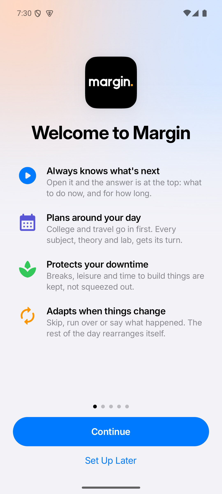 | 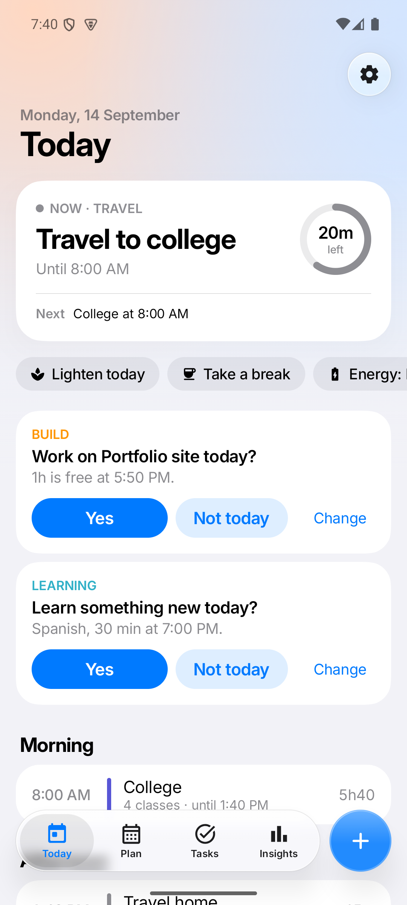 |
| Launch | First run | Today, morning |
| 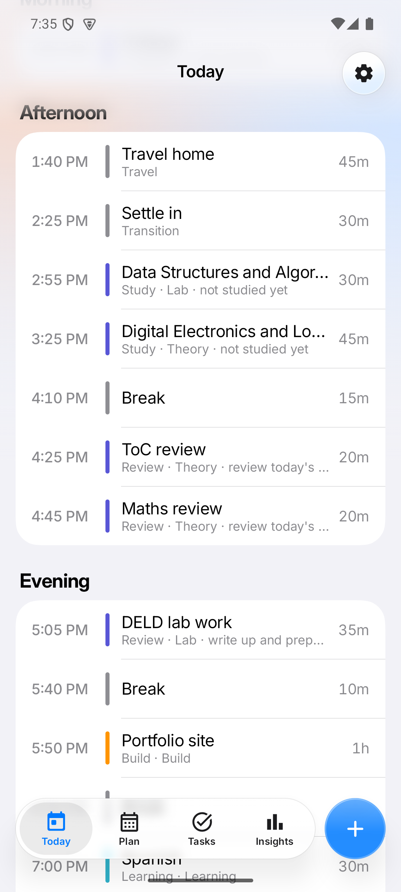 | 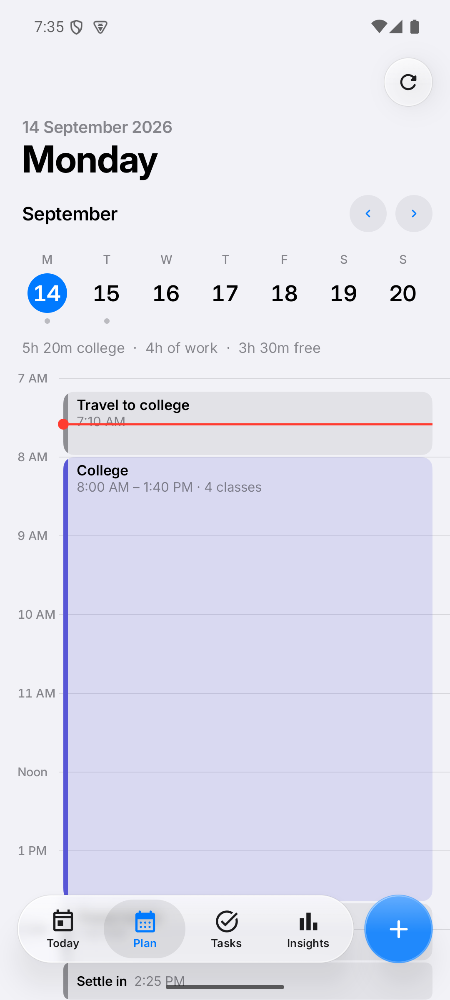 | 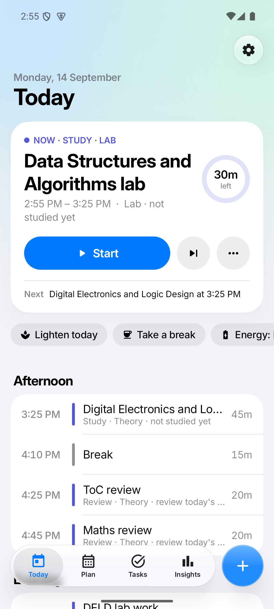 |
| The rest of the day | Plan | A study session is due |
| 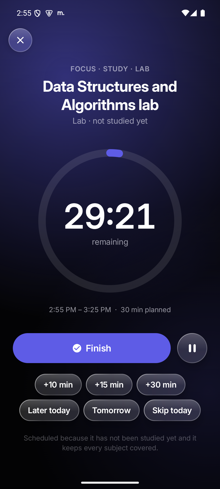 | 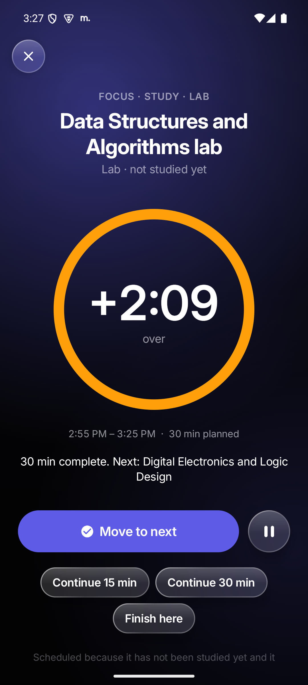 | 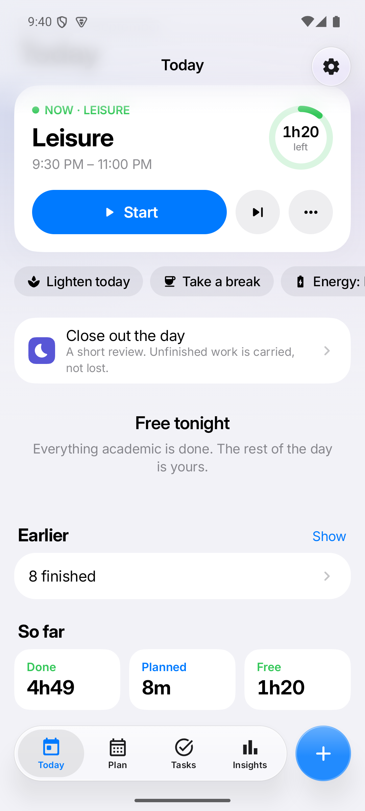 |
| Focus | Planned time is up | Evening, everything done |
| 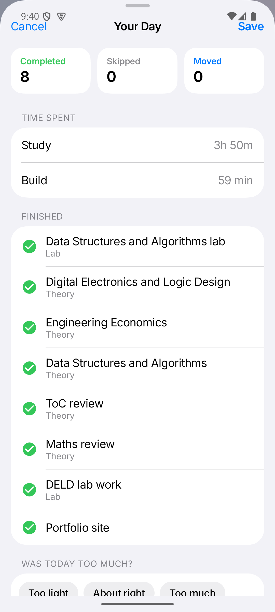 | 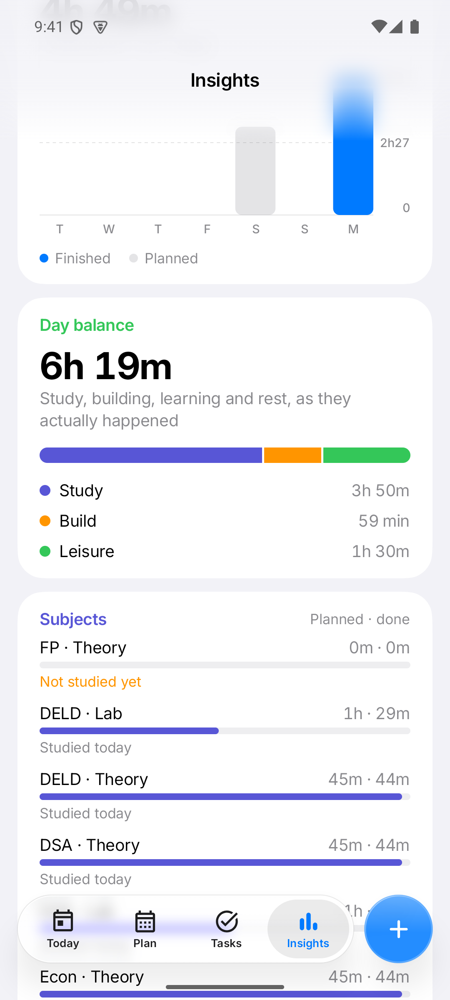 | 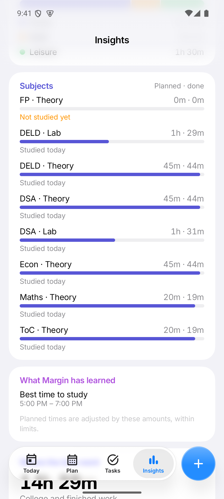 |
| End-of-day review | Day balance | Every subject, theory and lab |

## The rule the AI plays by

```
USER INPUT  →  AI understanding  →  structured command  →  validation  →  database
                                                                              ↓
UI / notification  ←  new plan  ←  scheduling engine  ←──────────────────────┘
```

The model can only speak in the commands defined in `ai/AiCommand.kt`, and every one passes
`CommandValidator` before it touches storage. Arbitrary text never becomes app state. With no
API key configured, `LocalCommandParser` handles the common phrasings on-device.

---

## Project structure

```
app/src/main/java/com/margin/app/
  core/          Time helpers: the only bridge between engine integers and the calendar
  domain/
    model/       Domain types, no Android imports
    planner/     The scheduling engine. Pure Kotlin, unit tested
    usecase/     PlanningService, ScheduleActions, SeedService
  data/
    db/          Room entities, DAOs, mappers
    repository/  Timetable, Task, Schedule
    prefs/       DataStore settings, AI settings in their own store
    seed/        The shipped timetable
  ai/            Provider-agnostic client, command schema, validation, offline parser
  notifications/ Channels, alarms, notification actions, WorkManager, focus service
  ui/
    theme/       Design system: colour, type, shape, spacing
    components/  Shared vocabulary every screen is assembled from
    today/ plan/ tasks/ timetable/ insights/ settings/ focus/ assistant/ onboarding/
  di/            AppContainer, the whole object graph
```

Docs: [ARCHITECTURE](docs/ARCHITECTURE.md) · [SCHEDULING](docs/SCHEDULING.md) ·
[DESIGN](docs/DESIGN.md) · [BUILDING](docs/BUILDING.md)

---

## Building

Requires JDK 17 and the Android SDK (platform 35, build-tools 35). See
[docs/BUILDING.md](docs/BUILDING.md) for a from-scratch toolchain setup.

```bash
./gradlew :app:assembleDebug
```

The APK lands at `app/build/outputs/apk/debug/app-debug.apk`.

Run the unit tests (the scheduling engine, the allocator, the validator, the offline parser):

```bash
./gradlew :app:testDebugUnitTest
```

Instrumented tests need a connected device or emulator:

```bash
./gradlew :app:connectedDebugAndroidTest
```

## Installing on a phone

Enable Developer options and USB debugging on the phone, connect it, then:

```bash
adb install -r app/build/outputs/apk/debug/app-debug.apk
```

Or copy the APK to the phone and open it, allowing installation from that source.

## Configuring the assistant

No key is compiled into the app and none is required. To enable free-form natural language:

1. Open **Settings → Assistant**.
2. Choose a provider (OpenAI or Anthropic).
3. Paste your own API key and tap **Save and Test**. The app makes a real request and shows
   "OpenAI connected successfully" only if it works; otherwise it says why.

The key is encrypted with an Android Keystore key and stored in a DataStore file separate
from the rest of the settings, excluded from cloud backup. Requests contain only the current time, your free windows, the titles and
times of today's blocks, and your open work — never notes, history or the database. Turning
off **Share the shape of my day** narrows that to the clock and free time alone. Common
sentences ("I'm out until 9", "make today lighter", "DS exam on Nov 12") are understood on
the device and never sent anywhere.

---

## Licence

Personal project. No warranty.
